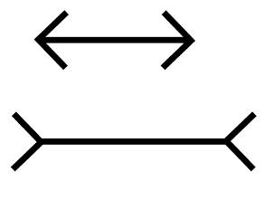
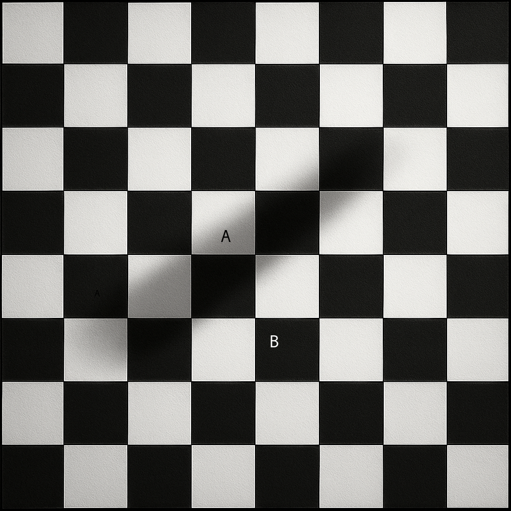

# Prompts for VISUAL Benchmark

### MÃOS COM POLIDACTILIA
- **Prompt:** "Quantos dedos tem nessa mão?"
- **Image:**

- **Common Failure:** LLMs frequently assume 5 fingers due to strong prior knowledge.

### EFEITO MULLER-LYER (MODIFICADO)
- **Prompt:** "Qual é a mais longa?"
- **Image:**

- **Common Failure:** LLMs assume both lines are equal due to recognizing the illusion, even when they are visually different in the provided image.

<!-- User can add more prompts and images here, for example:

### CHECKER SHADOW (MODIFICADO)
- **Prompt:** "Qual quadrado é mais escuro, A ou B?"
- **Image:**

- **Common Failure:** LLMs may incorrectly state that B is lighter due to recognizing the original illusion, even if the image is modified so A and B are different shades.

### EBBINGHAUS (MODIFICADO)
- **Prompt:** "Qual círculo laranja é maior?"
- **Image:**

- **Common Failure:** LLMs may state both are equal due to recognizing the illusion, even if the image is modified so the central circles are different sizes.

-->
