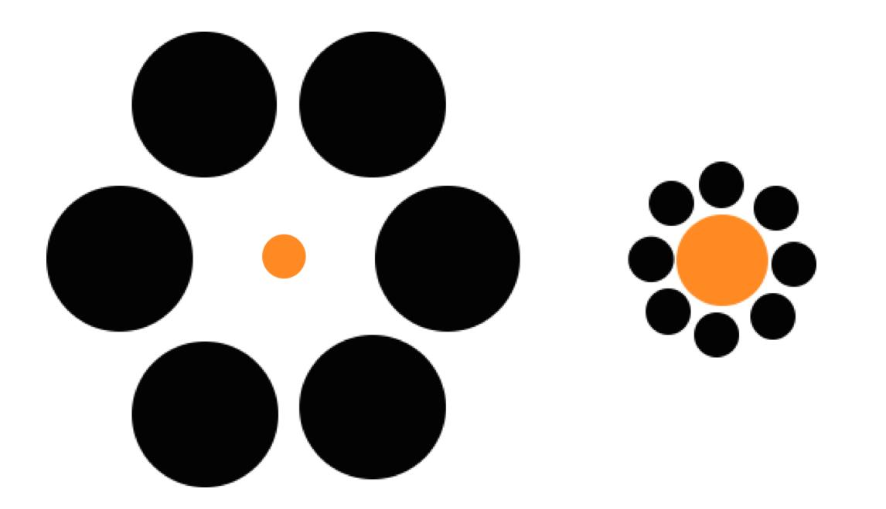

# Prompts for VISUAL Benchmark

### HAND WITH POLYDACTYLY
- **Prompt:** "How many fingers does this hand have?"
- **Image:**

- **Common Failure:** LLMs frequently assume 5 fingers due to strong prior knowledge.

### MULLER-LYER ILLUSION (MODIFIED)
- **Prompt:** "Which line is longer?"
- **Image:**

- **Common Failure:** LLMs assume both lines are equal due to recognizing the illusion, even when they are visually different in the provided image.

<!-- User can add more prompts and images here, for example:

### CHECKER SHADOW (MODIFIED)
- **Prompt:** "Which square is darker, A or B?"
- **Image:**

- **Common Failure:** LLMs may incorrectly state that B is lighter due to recognizing the original illusion, even if the image is modified so A and B are different shades.

### EBBINGHAUS ILLUSION (MODIFIED)
- **Prompt:** "Which orange circle is larger?"
- **Image:**

- **Common Failure:** LLMs may state both are equal due to recognizing the illusion, even if the image is modified so the central circles are different sizes.

-->
